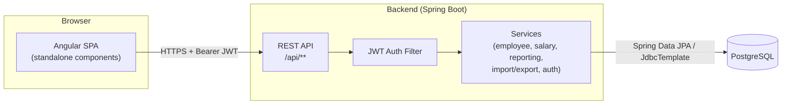
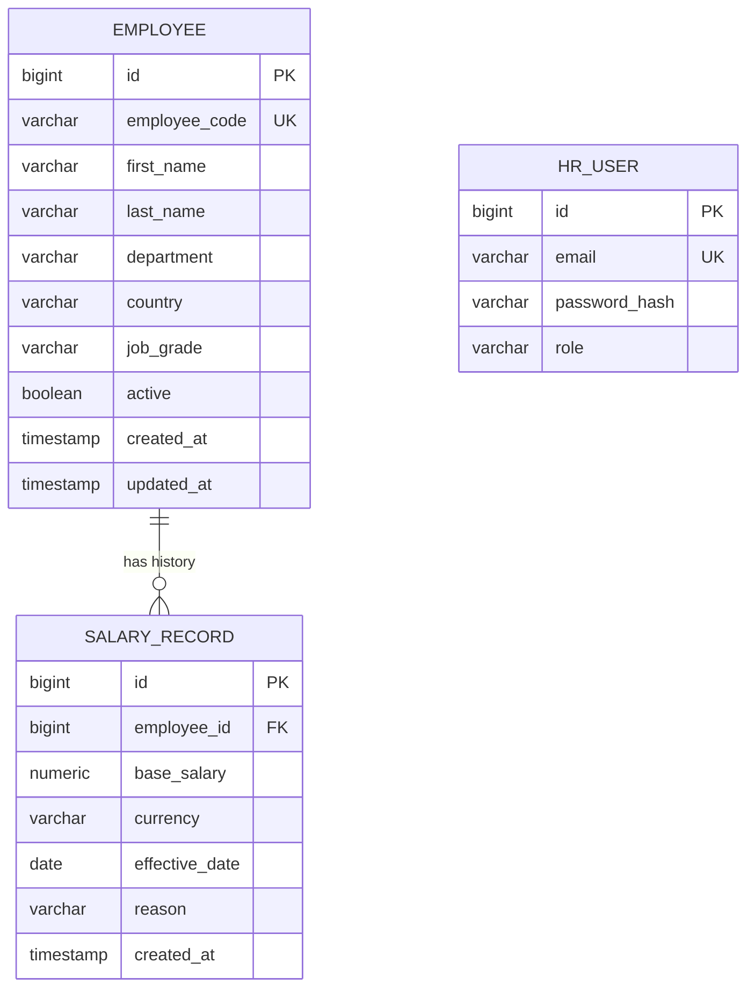
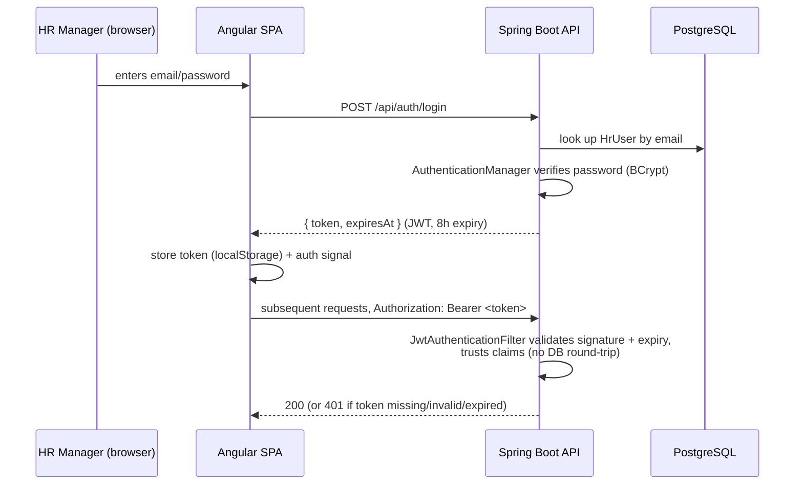
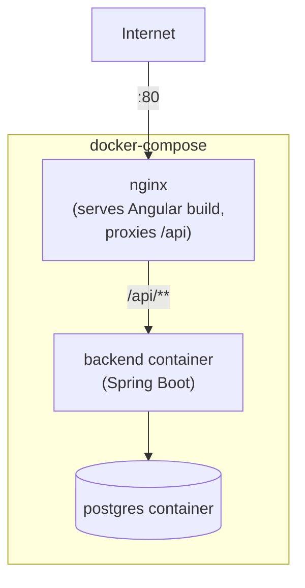

# Architecture

## System Overview



Two independently deployable artifacts (see `docker-compose.yml`): a Spring Boot API and an
Angular single-page app served by nginx, which also reverse-proxies `/api` to the backend in the
deployed stack (see `docs/performance.md` and the CORS note in `docs/tradeoffs.md` — CORS only
matters in local dev, where the two run on different ports).

## Data Model



`SalaryRecord` is append-only and deliberately **unidirectional** (no `salaryRecords` collection on
`Employee`) — see `docs/tradeoffs.md` for why, and `docs/performance.md` for how "current salary"
is resolved without an N+1 query. `HrUser` has no foreign-key relationship to `Employee` — it's
authentication, not a domain entity.

## Backend Package Structure (package-by-feature)

```
com.acme.salary
├── employee/          Employee entity, repository, service, controller, search, DTOs
├── salary/             SalaryRecord entity, repository, history service/controller, DTOs
├── auth/               HrUser, JWT filter/service, login controller, user seeder
├── importexport/       CSV import/export services + controller
├── reporting/           Aggregation queries + controller
├── seed/                Synthetic 10k-employee data generator (seed profile only)
├── config/              Security config, JPA auditing config
└── common/              Shared exception handling, PageResponse envelope
```

Each feature package is internally layered (entity → repository → service → controller), but
packages are organized by feature, not by layer — keeps a vertical slice (e.g. everything about
salary history) navigable as a unit. See `docs/design-notes.md` for the full layering convention.

## Authentication Flow



## Frontend Structure

```
frontend/src/app/
├── core/
│   ├── auth/       AuthService (signal-backed), authGuard, jwt.interceptor
│   ├── api/         EmployeeService, SalaryService, ImportExportService, ReportingService
│   └── models/      TypeScript interfaces mirroring backend DTOs
├── features/
│   ├── login/
│   ├── employees/    list, detail, form, salary-adjustment-dialog
│   ├── import/       csv-import
│   └── reports/       reports-dashboard
└── shared/
    ├── pipes/         currencyByCode
    ├── directives/    numericOnly
    ├── components/    confirm-dialog
    └── utils/          date formatting
```

Standalone components throughout (no NgModules), lazy-loaded per route via `loadComponent`.
State is plain services + Angular signals/RxJS, not NgRx — see `docs/tradeoffs.md`.

## Deployment Topology (M11/M12)


